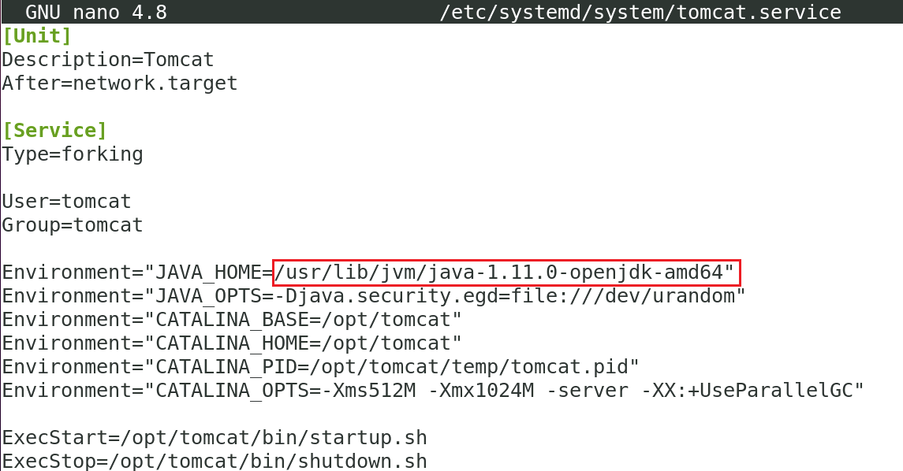

# Instalación de Tomcat.

Es conveniente que desinstalemos de la máquina virtual cualquier otro servidor web que estuviera presente, ya que podría interferir con Tomcat.

Si nginx estuviera instalado, procedemos a su desinstalación.


Para desinstalar Nginx en Ubuntu 20.04, puedes seguir estos pasos:

1. **Detener el servicio de Nginx**: Primero, asegúrate de detener el servicio de Nginx para evitar cualquier interrupción durante el proceso de desinstalación. Puedes detenerlo ejecutando el siguiente comando en tu terminal:

```bash
sudo systemctl stop nginx -y
```

(CASO APACHE2)  
**Detener el servicio de Apache2**: Primero, asegúrate de detener el servicio de Nginx para evitar cualquier interrupción durante el proceso de desinstalación. Puedes detenerlo ejecutando el siguiente comando en tu terminal:

```bash
sudo systemctl stop apache2 -y
```


## OPCION 1: Deshabilitar el servicio de NGINX O APACHE (el que esté activo)

2. Aunque no es imprescindible, ya que mientras Apache Tomcat no use los mismos puertos que NGINX o Apache2, en el caso de que quisieramos delegar el puerto SSL (443) a Apache Tomcat, habria una competenciaa por ese puerto, que solo uno de los dos servicios podría mantener.


CASO DESHABILITAR NGINX  
```bash
sudo systemctl disable nginx 
```
---

CASO DESHABILITAR Apache2  
```bash
sudo systemctl disable apache2
```


## OPCION 2: Desinstalar el servicio de NGINX (SI QUEREMOS QUE EL SERVIDOR ESTÉ DEDICADO A TOMCAT Y NO QUEREMOS QUE CONVIVA CON NGNX / APACHE2

2. **Desinstalar el paquete Nginx**: Una vez que el servicio de Nginx esté detenido, puedes proceder a desinstalar el paquete Nginx. Ejecuta el siguiente comando en la terminal:

```bash
sudo apt-get remove --purge nginx -y
```

Este comando eliminará el paquete Nginx y todos sus archivos de configuración, pero dejará los archivos de datos (como los sitios web) intactos.

3. **Eliminar archivos de configuración residuales**: Si deseas eliminar todos los archivos de configuración residuales de Nginx, puedes ejecutar el siguiente comando:

```bash
sudo apt-get purge nginx-common -y
```

Este comando eliminará cualquier archivo de configuración o datos adicionales relacionados con Nginx.

4. **Limpiar la caché del sistema de paquetes**: Finalmente, puedes limpiar la caché del sistema de paquetes para liberar espacio en disco y eliminar cualquier referencia a Nginx. Ejecuta el siguiente comando:

```bash
sudo apt-get autoremove -y
```

Este comando eliminará cualquier paquete instalado que ya no sea necesario, incluidas las dependencias que se instalaron junto con Nginx.

### NOTA: El proceso de desintalación de apache2 sería muy parecido, cambiando nginx por apache2

## Creación de usuario tomcat, instalación de JDK y descarga de Tomcat.

Por razones de seguridad, Tomcat debería ser ejecutado en el contexto de un usuario específico que no tenga privilegios y con el que no podamos iniciar sesión nosotros. Creamos el usuario `tomcat`. Nota: el parámetro `/bin/false` indica a Linux que nadie podrá usar la cuenta `tomcat` para inicar sesión en el sistema.

```bash
sudo useradd -m -d /opt/tomcat -U -s /bin/false tomcat
```

Procedemos a instalar el JDK. El primer lugar actualizamos el repositorio.

```bash
sudo apt update -y
```

Instalamos el JDK.

```bash
sudo apt install default-jdk -y
```

Comprobamos la versión que se ha instalado de JDK de Java.

```bash
java -version
```

Para instalar Tomcat, debemos descargarlo desde su página: https://tomcat.apache.org/download-10.cgi

Cambiamos al directorio `/tmp` para descargarlo y descomprimirlo.

```bash
cd /tmp
```

```bash
wget https://dlcdn.apache.org/tomcat/tomcat-10/v10.1.40/bin/apache-tomcat-10.1.40.tar.gz
```

```bash
sudo tar xzvf apache-tomcat-10*tar.gz -C /opt/tomcat --strip-components=1
```

Asignamos la propiedad de los archivos de Tomcat al usuario `tomcat`

```bash
sudo chown -R tomcat:tomcat /opt/tomcat/
```

Asignamos el permiso de ejecución a todos los archivos de la carpeta `/opt/tomcat/bin`.

```bash
sudo chmod -R u+x /opt/tomcat/bin
```

## Configuración de los usuarios administradores de Tomcat.

Tomcat va a ser gestionado por una página web, como la siguiente:


Concretamente en las páginas `Manager`y `Host Manager` que para poder ser usadas es necesario definir qué usuarios podrán acceder a ellas. Esto se hace en la configuración de Tomcat, concretamente en el archivo `/opt/tomcat/conf/tomcat-users.xml`

Editamos el archivo.

```bash
sudo nano /opt/tomcat/conf/tomcat-users.xml
```

Debemos añadir el siguiente código al final del archivo, justo antes de la etiqueta `</tomcat-users>`.

```xml
<role rolename="manager-gui" />
<user username="manager" password="Avante-24,.-" roles="manager-gui" />

<role rolename="admin-gui" />
<user username="admin" password="Avante-24,.-" roles="manager-gui,admin-gui" />
```

Observa, debe quedar en la siguiente posición. En color ***rojo*** destacamos el contenido a pegar, y en color ***amarillo*** señalizamos la etiqueta.


Hemos actualizado la contraseña a `Avante-24,.-`. 

Como podemos ver, el código insertado crea los usuarios `manager` y `admin`, asignando a cada uno respectivamente los roles `manager-gui` y `admin-gui`, que permiten el acceso a las páginas de de administración `Manager` y `Host Manager`.

Guardamos el archivo y salimos.

Es importante saber que, por defecto, Tomcat está configurado para ***restringir el acceso a las páginas de administración***, a menos que la conexión provenga del propio servidor. Para acceder a esas páginas con los usuarios que acabamos de definir desde otrás máquinas, necesitaremos editar los archivos de configuración de esas páginas.

Para eliminar la restricción de la página `Manager`, editamos su archivo de configuración:

```bash
sudo nano /opt/tomcat/webapps/manager/META-INF/context.xml
```

En Tomcat, las etiquetas `valves` son componentes que se utilizan para interceptar y procesar solicitudes entrantes y salientes en el servidor Tomcat. Estos pueden ser utilizados para realizar acciones específicas, como la autenticación, el registro, la `limitación de acceso`, que es lo que nos interesa.

En particular, `RemoteAddrValve` es una válvula específica que permite restringir el acceso a recursos de Tomcat basándose en la dirección IP remota del cliente. Es decir, solo permite el acceso a los recursos de Tomcat desde direcciones IP específicas.

Como podemos ver, esta equiteta limita el acceso desde la IP de localhost, a través de la expresión regular `allow="127\.\d+\.\d+\.\d+|::1|0:0:0:0:0:0:0:1"`.

Para que podamos conectar desde cualquier IP, necesitamos que esta etiqueta no se procese. La forma más sencilla es comentarla en xml, como podemos ver en la siguiente imagen (indicado por los rectángulos en color rojo).


Asegúrate que el archivo queda así y guárdalo.


Ahora debemos hacer lo mismo para el Host Manager. Editamos el archivo.

```bash
sudo nano /opt/tomcat/webapps/host-manager/META-INF/context.xml
```

Asegúrate de que queda como  la siguiente imagen. Guarda el archivo y cierra el editor.


## Creación de un servicio en systemd.

El servicio systemd que vamos a crear hará que Tomcat se ejecute en segundo plano, que se inicie automáticamente al iniciar el sistema o se reinicie si Tomcat detecta un error o fallo.

Tomcat es una aplicación Java en sí misma, por eso requiere que el runtime de  Java esté presente (JRE), pero eso ya lo hemos conseguido cuando instalamos el JDK. En consecuencia, antes de crear el servicio, necesitamos saber dónde se encuentra Java. 

Para ello ejecutamos el siguiente comando:

```bash
sudo update-java-alternatives -l
```

La salida indica la ruta del JRE de java.


La ruta mostrada vamos a usarla en breve.

El servicio `tomcat`se almacena en `systemd` en un archivo llamado `tomcat.service`, en la carpeta `/etc/systemd/system`. Vamos a crear este archivo.

```bash
sudo nano /etc/systemd/system/tomcat.service
```

Copia y pega en el archivo el siguiente contenido.

```bash
[Unit]
Description=Tomcat
After=network.target

[Service]
Type=forking

User=tomcat
Group=tomcat

Environment="JAVA_HOME=/usr/lib/jvm/java-1.11.0-openjdk-amd64"
Environment="JAVA_OPTS=-Djava.security.egd=file:///dev/urandom"
Environment="CATALINA_BASE=/opt/tomcat"
Environment="CATALINA_HOME=/opt/tomcat"
Environment="CATALINA_PID=/opt/tomcat/temp/tomcat.pid"
Environment="CATALINA_OPTS=-Xms512M -Xmx1024M -server -XX:+UseParallelGC"

ExecStart=/opt/tomcat/bin/startup.sh
ExecStop=/opt/tomcat/bin/shutdown.sh

RestartSec=10
Restart=always

[Install]
WantedBy=multi-user.target
```

Asegúrate que la ruta del JRE de Java conincide con la que localizamos antes.



El contenido del archivo `tomcat.service` define un servicio que ejecutará Tomcat mediante la ejecución de los scripts de inicio y apagado que proporciona. También configura algunas variables de entorno para definir su directorio de inicio (que es `/opt/tomcat`) y limitar la cantidad de memoria que la VM de Java puede asignar (en CATALINA_OPTS). En caso de fallo, el servicio de Tomcat se reiniciará automáticamente.

Cuando hayas terminado, guarda y cierra el archivo.

Recargamos el demonio `systemd` para que reconozca el nuevo servicio.

```bash
sudo systemctl daemon-reload
```

Iniciamos el servicio de Tomcat.

```bash
sudo systemctl start tomcat
```

Comprobamos su estado.

```bash
sudo systemctl status tomcat
```

Si todo ha ido bien, Linux debe indicar que el servicio está activo (running)


Para conseguir que Tomcat inicie su servicio al inicar el sistema operativo, ejecutamos lo siguiente.

```bash
sudo systemctl enable tomcat
```

Con esto hemos aprendido a instalar nuestro servidor Tomcat desde cero.

## Usar la página de administración de Tomcat.

Tomcat levanta un servidor en el puerto `8080` con la web de administración. Para poder conectar con él, debemos abrir el firewall.

```bash
sudo ufw allow 8080
```

Ahora, por medio del navegador, conectamos a la interfaz gráfica de administración.

```url
http://localhost:8080
```

Para acceder al administrador de aplicaciones `Manager app` hacemos clic en el botón correspondiente. Se nos pedirá las crecenciales que configuramos anteriormente.

Como usuario podemos:

```plaintext
admin
```

y por contraseña escribimos:

```plaintext
Avante-24,.-
```

La página de administración de aplicaciones del servidor Tomcat es muy sencilla y amigable. En la sección `applications` podemos ver qué aplicaciones está sirviendo nuestro servidor. En la imagen hemos señalado por medio de rectángulos de color rojo las zonas de interés.


En la columna `path` tenemos la URI asociada a la aplicación, mientras que en la columna `commands` aparecen todas las acciones que el administrador puede hacer sobre la aplicación en cuestión.

Coge el navegador y conecta con la siguiente aplicación.

```url
http://localhost:8080/docs
```

Prueba a usar los botónes de `stop`, `start` y `reload` y observa el comportamiento (debes usar CTRL+F5 para evitar la caché del navegador)

## Despliegue de Aplicaciones en Tomcat usando la página de administración

La sección `deploy` permite instalar nuevas aplicaciones en el servidor Tomcat. 


Para ello debemos proporcionar cierta información en el formulario de implementación.

Un archivo `WAR` (Web Application Archive) es un tipo de archivo utilizado en el desarrollo de aplicaciones web Java. Está diseñado para ***empaquetar y distribuir*** una aplicación web Java completa, incluyendo todos los archivos necesarios para su ejecución en un contenedor de servlets como Apache Tomcat.

Un archivo WAR puede contener los siguientes elementos:

1. **Archivos de recursos estáticos**: Estos son archivos como HTML, CSS, JavaScript, imágenes y otros recursos estáticos que son necesarios para la interfaz de usuario de la aplicación web. Estos archivos se encuentran típicamente en el directorio `WEB-INF` dentro del archivo WAR.

2. **Archivos de clases Java**: Los archivos de clases Java compiladas, junto con cualquier otra clase o biblioteca de terceros que la aplicación web pueda necesitar, se encuentran dentro del archivo WAR. Estas clases contienen la lógica de negocio y el comportamiento de la aplicación.

3. **Descriptores de implementación**: Un archivo WAR contiene uno o más descriptores de implementación que proporcionan información sobre cómo se debe implementar y ejecutar la aplicación web en el contenedor de servlets. El archivo `web.xml` es el descriptor de implementación más común para aplicaciones web Java basadas en Servlet, mientras que las aplicaciones más modernas también pueden utilizar descriptores de implementación en forma de anotaciones Java (esto es preferido).

4. **Metadatos y recursos adicionales**: Además de los elementos anteriores, un archivo WAR puede contener otros recursos y metadatos necesarios para la ejecución de la aplicación web, como archivos de configuración, archivos de propiedades, archivos de internacionalización (i18n), etc.

Los archivos WAR los genera el desarrollador por medio de un entorno de desarrollo (VSC, Eclipse, NetBeans, etc) Estos entornos permiten empaquetar la aplicación usando herramientas como `Maven` o `Gradle`, aunque también podríamos hacerlo nosotros a través del programa `jar`, que sirve para crear estos paquetes.

### Creación manual de un archivo WAR.

Como hemos mencionado, la forma correcta de obtener este archivo es por medio del entorno de desarrollo. No obstante, con la idea de que se entienda claramente como se implementa la aplicación, vamos a realizar esta tarea de forma manual.

Aquí tienes un ejemplo muy sencillo de una aplicación web Java que muestra un mensaje "Hola Mundo" en una página JSP, y luego te mostraré cómo generar un archivo WAR para esta aplicación:

1. **Crea una estructura de directorios para tu proyecto**:

En primer lugar debemos crear una estructura de archivos que sea compatible con el despligue de aplicaciones en el servidor Tomcat. Esta estructura es la siguiente.

```
mi-aplicacion/
  └── src/
      └── main/
          ├── java/
          │   └── com/
          │       └── ejemplo/
          │           └── controlador/
          │               └── HolaMundoServlet.java
          ├── resources/
          └── webapp/
              └── WEB-INF/
                  └── web.xml
              └── index.jsp
```

Los comandos a ejecutar son:

```bash
cd ~
```

```bash
mkdir -p mi-aplicacion/src/main/java/com/ejemplo/controlador
```

```bash
mkdir -p mi-aplicacion/src/main/resources
```

```bash
mkdir -p mi-aplicacion/src/main/webapp/WEB-INF/
```

```bash
mkdir -p mi-aplicacion/src/main/webapp/
```

2. **Código de la clase Java `HolaMundoServlet.java`**:

Creamos el archivo del Servlet.

```bash
nano mi-aplicacion/src/main/java/com/ejemplo/controlador/HolaMundoServlet.java
```

Pegamos el siguiente código, guardamos y salimos.

```java
package com.ejemplo.controlador;

import java.io.IOException;
import javax.servlet.ServletException;
import javax.servlet.annotation.WebServlet;
import javax.servlet.http.HttpServlet;
import javax.servlet.http.HttpServletRequest;
import javax.servlet.http.HttpServletResponse;

@WebServlet("/HolaMundoServlet")
public class HolaMundoServlet extends HttpServlet {
    private static final long serialVersionUID = 1L;

    protected void doGet(HttpServletRequest request, HttpServletResponse response) throws ServletException, IOException {
        response.setContentType("text/html");
        response.getWriter().println("<html><head><title>Hola Mundo</title></head><body>");
        response.getWriter().println("<h1>Hola Mundo desde un Servlet</h1>");
        response.getWriter().println("</body></html>");
    }
}
```

3. **Código de la página JSP `index.jsp`**:

Lo siguiente es el archivo JSP.

```bash
nano mi-aplicacion/src/main/webapp/index.jsp
```

Pegamos el siguiente código, guardamos y salimos del editor.

```jsp
<!DOCTYPE html>
<html>
<head>
    <title>Página de inicio</title>
</head>
<body>
    <h1>Bienvenido a mi app web</h1>
    <p>Este es un ejemplo simple de una app Java.</p>
</body>
</html>
```

4. **Archivo de configuración `web.xml`**:

Es el momento del archivo `web.xml`.

```bash
nano mi-aplicacion/src/main/webapp/WEB-INF/web.xml
```

Pegamos el siguiente código, guardamos y salimos del editor.

```xml
<?xml version="1.0" encoding="UTF-8"?>
<web-app xmlns="http://xmlns.jcp.org/xml/ns/javaee" xmlns:xsi="http://www.w3.org/2001/XMLSchema-instance" xsi:schemaLocation="http://xmlns.jcp.org/xml/ns/javaee http://xmlns.jcp.org/xml/ns/javaee/web-app_3_1.xsd" version="3.1">
    <display-name>Mi Aplicación</display-name>
    <welcome-file-list>
        <welcome-file>index.jsp</welcome-file>
    </welcome-file-list>
    <servlet>
        <servlet-name>HolaMundoServlet</servlet-name>
        <servlet-class>com.ejemplo.controlador.HolaMundoServlet</servlet-class>
    </servlet>
    <servlet-mapping>
        <servlet-name>HolaMundoServlet</servlet-name>
        <url-pattern>/HolaMundoServlet</url-pattern>
    </servlet-mapping>
</web-app>
```

5. **Empaquetamos la aplicación en un archivo WAR**:

Necesitamos una herramienta que genere el WAR y sin duda `Maven` es una de la más utilizadas. Lo primero que debemos hacer es instalarla en Linux.

```bash
sudo apt update -y
```

```bash
sudo apt install maven -y
```

Enctramos en el directorio del proyecto.

```bash
cd mi-aplicacion
```

Para que `Maven` sepa qué necesita nuestra aplicación e incorpore esas dependencias al war, necesitamos crear el archivo `pom.xml`.

```bash
nano pom.xml
```

Pegamos el siguiente contenido, guardamos y salimos.

```xml
<project xmlns="http://maven.apache.org/POM/4.0.0"
         xmlns:xsi="http://www.w3.org/2001/XMLSchema-instance"
         xsi:schemaLocation="http://maven.apache.org/POM/4.0.0 http://maven.apache.org/xsd/maven-4.0.0.xsd">
    <modelVersion>4.0.0</modelVersion>
    
    <groupId>com.ejemplo</groupId>
    <artifactId>mi-aplicacion</artifactId>
    <version>1.0-SNAPSHOT</version>
    <packaging>war</packaging>
    
    <properties>
        <maven.compiler.source>1.8</maven.compiler.source>
        <maven.compiler.target>1.8</maven.compiler.target>
    </properties>
    
    <dependencies>
        <dependency>
            <groupId>javax.servlet</groupId>
            <artifactId>javax.servlet-api</artifactId>
            <version>4.0.1</version>
            <scope>provided</scope>
        </dependency>
    </dependencies>
</project>
```

Empaquetamos la aplicación.

```bash
mvn package
```

Esto generará un archivo WAR en el directorio `target` de tu proyecto, tal y como podemos ver en la imagen.


Ya solo queda usar la interfaz gráfica para implementar el archivo `war`. Lo conseguimos mediante el botón de importar war.


Como resultado, la aplicación se implementará en Tomcat y estará disponible.


Para comprobar su funcinamiento, nos conectamos con el navegador a:

```url
http://localhost:8080/mi-aplicacion-1.0-SNAPSHOT/
```

---

## Despliegue de Aplicaciones en Tomcat. 

El despliegue en Tomcat puede realizarse de forma automática (Tomcat Manager) o manual. Implica preparar un archivo WAR de la aplicación y copiarlo a la carpeta webapps del servidor Tomcat. Como ya se ha introducido, se puede usar el gestor de aplicaciones de Tomcat (Tomcat Manager) para desplegar la aplicación de forma automatizada. 

### Entonces, las lormas comunes de despliegue son:

1. **Despliegue remoto / automático (manager):** (Ya visto)
   Usando la aplicación `manager` de Tomcat y comandos HTTP.

2. **Copia directa del archivo WAR a la carpeta `webapps/`:**
   Tomcat desplegará automáticamente la aplicación al detectar el WAR. El nombre del archivo determina el nombre del contexto (ejemplo: `miapp.war` se accede como `/miapp`).

---

### Copia directa del archivo WAR a la carpeta `webapps/`

**Normalmente, en linux, en: /opt/tomcat/webapps/**

1. Preparar el archivo WAR:
   Si estás usando un IDE como Eclipse, puedes exportar tu proyecto web como un archivo WAR. 
   Si no estás usando un IDE, puedes crear el archivo WAR manualmente usando herramientas como jar. 

2. Copiar el archivo WAR a la carpeta webapps:
   Ubica la carpeta webapps dentro de tu instalación de Tomcat. 
   Copia el archivo WAR generado en esta carpeta. 

3. Reiniciar Tomcat (si es necesario):
   Si el archivo WAR no se desplega automáticamente, puedes reiniciar Tomcat para que detecte los cambios en la carpeta webapps. 

4. Acceder a la aplicación:
   Abre tu navegador web y navega a la URL de la aplicación (por ejemplo, http://localhost:8080/nombre_de_la_aplicacion). 


## Estructura de Directorios de una Aplicación Web en Tomcat 10. Contextos.

Una aplicación web Java debe estar estructurada en un archivo `.war` (Web Application Archive), o en un directorio con la misma estructura, para ser desplegada correctamente por Tomcat.

### Estructura General:

Cada aplicación Web se encuentra en un directorio debajo de webapps (cada directorio debajo de webapps se denomina contexto de Tomcat). En otras palabras, Tomcat vigila esa carpeta y automáticamente despliega cualquier directorio o archivo .war que pongas ahí.

Por tanto, cada directorio corresponde a un contexto. Un contexto en Tomcat es una aplicación web completa que se accede a través de una ruta base (context path) en la URL.

#### ¿Qué significa que "cada directorio debajo de `webapps` se denomina contexto de Tomcat"?

##### 1. **`webapps/` es la carpeta de despliegue por defecto en Tomcat**

Cuando instalas Tomcat, dentro de su estructura hay una carpeta llamada:

```
$CATALINA_BASE/webapps/
```

Como ya hemos mencionado, Tomcat **vigila** esa carpeta y automáticamente despliega cualquier directorio o archivo `.war` que pongas ahí.

---

##### 2. **Cada subdirectorio dentro de `webapps/` representa un contexto**

* Un **contexto** en Tomcat es una aplicación web completa que se accede a través de una **ruta base (context path)** en la URL.
* Si tienes este directorio:

```
webapps/miapp/
```

Entonces, Tomcat lo interpretará como una aplicación web accesible en:

```
http://localhost:8080/miapp
```

* El nombre del directorio (`miapp`) se convierte en el **context path**.

---

##### 3. **El contexto especial `ROOT`**

* Si creas un directorio llamado `ROOT` dentro de `webapps`, Tomcat lo interpretará como la **aplicación principal**, accesible directamente en la raíz del servidor:

```
webapps/ROOT/
```

Corresponde a:

```
http://localhost:8080/
```

Esto es útil si quieres que una aplicación se cargue sin tener que ir a `/miapp`, `/tienda`, etc.

---

##### 4. **La estructura interna de cada contexto es siempre la misma**

Cada aplicación dentro de `webapps/` (es decir, cada contexto) debe tener esta estructura estándar:

```
miapp/
├── index.html
├── WEB-INF/
│   ├── web.xml
│   ├── classes/
│   └── lib/
├── META-INF/
```

* Esa estructura es obligatoria si quieres que Tomcat reconozca tu aplicación como válida.
* `WEB-INF/` contiene la lógica de backend.
* Todo lo que está **fuera de `WEB-INF/`** puede considerarse **contenido público** (recursos estáticos).

---

##### 5. **Ejemplo de contextos:**

Supón que tienes tres carpetas dentro de `webapps/`:

```
webapps/
├── miapp/
├── tienda/
├── ROOT/
```

Se acceden así:

* `http://localhost:8080/miapp` → aplicación en `webapps/miapp`
* `http://localhost:8080/tienda` → aplicación en `webapps/tienda`
* `http://localhost:8080/` → aplicación en `webapps/ROOT`

---

En resumen:

> Cada subcarpeta de `webapps` es una aplicación (un "contexto") que se accede con su propio path. El contexto ROOT se usa para la aplicación que quieres que esté en la raíz del servidor, y **todas** las aplicaciones deben seguir la misma estructura de carpetas para que Tomcat las entienda correctamente.


##### 6. **Un contexto un poco más desarrollado:**

```
miapp/
├── index.html
├── META-INF/
│   └── context.xml (opcional)
├── WEB-INF/
│   ├── web.xml
│   ├── classes/
│   │   └── [paquetes y clases compiladas]
│   └── lib/
│       └── [librerías .jar]
└── [archivos estáticos: .html, .css, .js, imágenes, etc.]
```

---

### Desglose de Carpetas y Archivos:

#### 1. **`index.html` y otros recursos raíz**

* Archivos accesibles directamente vía URL.
* No se colocan en `WEB-INF`, ya que esa carpeta es inaccesible desde el navegador.

#### 2. **`META-INF/`**

* Contiene metainformación sobre el paquete WAR.
* Puede incluir un `context.xml` para definir el contexto de despliegue.
* No es obligatorio para funcionar, pero se puede usar para configuraciones avanzadas.

#### 3. **`WEB-INF/`**

Carpeta protegida: el contenido **no es accesible directamente desde el navegador**. Solo el servidor puede acceder a su contenido.

##### a. `web.xml`

* Despliegue y configuración de la aplicación.
* Define servlets, filtros, listeners, rutas dinámicas, parámetros de contexto, etc.

##### b. `classes/`

* Archivos `.class` compilados.
* Estructura de paquetes replicada (ej. `com/empresa/controlador/MiServlet.class`).
* También se pueden incluir recursos internos, como `.properties`.

##### c. `lib/`

* Librerías `.jar` necesarias para la aplicación.
* Se cargan automáticamente al iniciar la app.
* No debes poner aquí las librerías del contenedor (como `jakarta.servlet-api.jar`).

---

### Notas importantes:

* La carpeta `WEB-INF` y su contenido **no son accesibles directamente desde el navegador**. Si visitas `/miapp/WEB-INF/web.xml`, Tomcat responderá con un 404.
* Los archivos en la raíz del WAR y subdirectorios públicos (`css/`, `js/`, `images/`, etc.) **sí son accesibles directamente**.
* El archivo `web.xml` es opcional si usas anotaciones como `@WebServlet`, pero sigue siendo común para proyectos empresariales.


---

## Gestión de Recursos Estáticos y Dinámicos

Un recurso es cualquier elemento que una aplicación web entrega al navegador del usuario a través de una URL. Puede ser una imagen, un archivo HTML, un fragmento de texto generado, una respuesta en JSON, etc.

En una aplicación web, los recursos pueden clasificarse como **estáticos** o **dinámicos**, según cómo se sirven al cliente y si requieren o no procesamiento del servidor.

### Recursos Estáticos

Son archivos almacenados físicamente dentro del proyecto y que se entregan tal cual al cliente, sin ningún tipo de procesamiento del lado del servidor.

* No requieren procesamiento del servidor.
* Incluyen archivos como: `.html`, `.css`, `.js`, `.jpg`, `.png`.
* Se ubican en la raíz de la aplicación o en subdirectorios.
* Son servidos directamente por Tomcat.

**Ejemplos:**

```
/miapp/index.html
/miapp/css/style.css
/miapp/img/logo.png
```

**¿Cómo los maneja Tomcat?**  
Tomcat los sirve directamente desde el sistema de archivos, sin pasar por ninguna lógica de la aplicación. Si colocas estos archivos en el lugar adecuado (fuera de WEB-INF/), estarán disponibles públicamente.


### Recursos Dinámicos

Son contenidos que se generan en tiempo real por el servidor en función de una petición específica. No existen como archivos fijos, sino que se construyen y se entregan al momento de recibir la solicitud.

* Se generan en tiempo de ejecución según la lógica del servidor.
* Incluyen Servlets, JSP, y cualquier framework backend (Spring MVC, JSF).
* Requieren configuración en `web.xml` o uso de anotaciones.

**Ejemplos típicos:**  

- Páginas personalizadas para un usuario
- Resultados de una búsqueda
- Formularios de login y autenticación
- Datos que provienen de una base de datos
- APIs que devuelven contenido en formato JSON o XML

---

### Comparación: Estático vs Dinámico

| Tipo de Recurso | Procesamiento                                   | Ejemplos de Ruta               |
| --------------- | ----------------------------------------------- | ------------------------------ |
| Estático        | Servido directamente por Tomcat                 | `/index.html`, `/css/main.css` |
| Dinámico        | Procesado por el servidor (Servlets, JSP, etc.) | `/login`, `/api/usuarios?id=5` |


[Vamos al siguiente contenido](./10-C.md)
