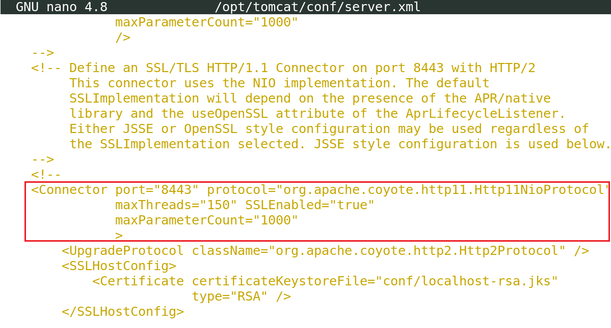

# Configurar SSL.

Vamos a proceder a instalar un certificado digital, en este caso autofirmado, para poder ofrecer SSL.

Lo primero es crear un archivo `keystore` para almacenar la `clave privada` del servidor y el `certificado autofirmado`. Ejecutamos el siguiente comando y escribimos una contraseña.

```bash
keytool -genkey -alias tomcat -keyalg RSA -keystore mi_almacen_de_claves.jks
```

Abrimos el archivo de configuración `server.xml` de Tomcat:

```bash
sudo nano /opt/tomcat/conf/server.xml
```

Busca la sección del conector donde se define el puerto SSL. Por lo general, esto se encuentra dentro de un elemento <Connector> que especifica el protocolo HTTP/1.1 y el puerto 8443.



Dentro de esta sección, agrega o modifica los siguientes atributos para habilitar SSL y configurar el certificado autofirmado. Asegúrate de reemplazar `/ruta/a/tu_almacen_de_claves.jks` con la ruta absoluta del archivo de almacén de claves que creaste anteriormente y `tu_contraseña_de_almacén` con la contraseña que especificaste durante la creación del certificado.

```xml
<Connector port="8443" protocol="org.apache.coyote.http11.Http11NioProtocol"
           maxThreads="150" SSLEnabled="true">
    <SSLHostConfig>
        <Certificate certificateKeystoreFile="/home/alumno/mi_almacen_de_claves.jks"
                     certificateKeystorePassword="Avante-24,.-"
                     type="RSA"/>
    </SSLHostConfig>
</Connector>
```

Abrimos el puerto en el firewall

```bash
sudo ufw allow 8443/tcp
```


Guardamos los cambios en el archivo `server.xml` y reinicia,os Tomcat para aplicar la configuración:

```bash
sudo systemctl restart tomcat
```

Verificación. Una vez que Tomcat se haya reiniciado correctamente, podemos verificar que el certificado esté funcionando correctamente accediendo a través de `HTTPS`:

```url
https://localhost:8443/
```

[Vamos al siguiente contenido](./10-D.md)