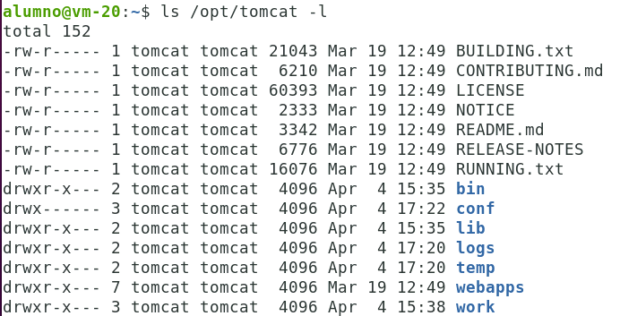
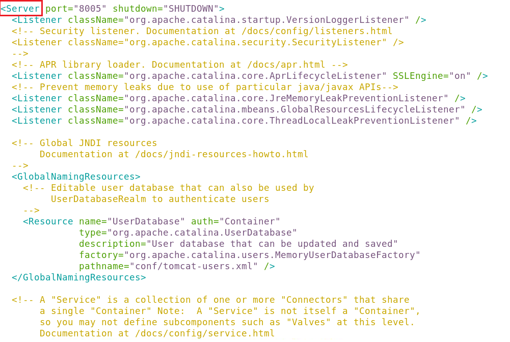
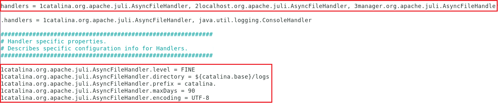
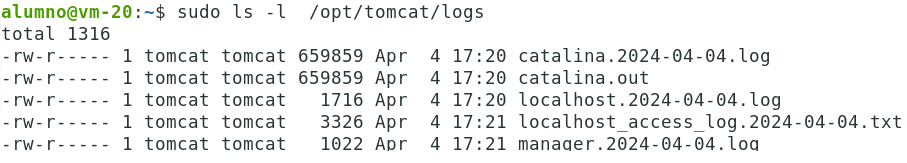
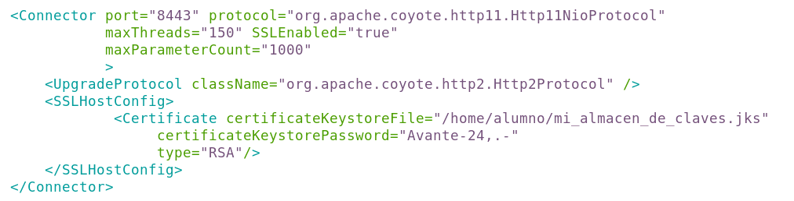

# Configuración de Tomcat.

En la instalación estándar de Tomcat 10, podemos encontrar los siguientes directorios importantes:

```bash
ls -l /opt/tomcat
```



- `bin`: Contiene los archivos ejecutables de Tomcat, como `startup.sh` (o `startup.bat` en Windows) para iniciar el servidor y `shutdown.sh` (o `shutdown.bat` en Windows) para detenerlo.
  
- `conf`: Contiene archivos de configuración importantes, como `server.xml`, que define la configuración del servidor, y `web.xml`, que define la configuración de los contextos web.

- `lib`: Contiene las bibliotecas de Java que utiliza Tomcat.

- `logs`: Aquí se almacenan los archivos de registro del servidor, como `catalina.out`, que contiene registros de inicio y errores de Tomcat.

- `webapps`: Es el directorio donde se despliegan las aplicaciones web. Al colocar un archivo WAR en este directorio, Tomcat lo desplegará automáticamente.

- `work`: Se utiliza internamente por Tomcat para almacenar archivos temporales relacionados con el despliegue y la ejecución de aplicaciones web.


El archivo `server.xml`, ubicado en el directorio `conf`, contiene la configuración principal del servidor Tomcat. Algunas de las configuraciones que podemos encontrar en este archivo incluyen:

- Definición de `conectores` HTTP y HTTPS.
- Configuración de los `puertos` en los que Tomcat escucha las solicitudes.
- Configuración de los `directorios base` para los archivos de despliegue y de registro.
- Configuración de `virtual hosts`.

Tomcat proporciona varias opciones de configuración de seguridad para proteger las aplicaciones web y el servidor en sí. Algunas de estas configuraciones incluyen:

- Configuración de acceso mediante autenticación de usuario y contraseña.
- Configuración de listas de acceso basadas en direcciones IP.
- Configuración de conexiones seguras a través de SSL/TLS.


Tomcat permite la configuración de diversos recursos que pueden ser utilizados por las aplicaciones web, como bases de datos, colas de mensajes, etc. Algunos ejemplos de recursos configurables incluyen:

- Conexiones a bases de datos (DataSource).
- Recursos JNDI para almacenar y recuperar objetos Java. JNDI (Java Naming and Directory Interface) es una API que permite a las aplicaciones Java buscar y obtener recursos de manera dinámica durante la ejecución sin depender de la ubicación o configuración específica de estos recursos.

Tomcat utiliza el sistema de logging de Java (`java.util.logging`) por defecto, pero también es compatible con otros sistemas de logging como `Log4j`. Podemos configurar el nivel de detalle de los registros y la salida de los registros en el archivo `logging.properties` ubicado en el directorio `conf`.

Los tipos de elementos (etiquetas) que podemos encontrarnos en `server.xml` son:

1. `Server`: Es el elemento superior en el archivo `server.xml`. Define un único servidor Tomcat. Generalmente. Un elemento Server puede contener elementos del tipo `Logger` y `ContextManager`.

    En la imagen podemos ver el inicio del elemento `server` en el archivo de configuración.

    

2. `Logger`: Cada logger tiene un nombre para identificarlo, así como una ruta al archivo de registro para contener la salida del logger y un nivel de verbosidad (que especifica el nivel de registro). 

    Un ejemplo de uso del elemento `<Logger>` es el siguiente:

    ```xml
    <Server port="8005" shutdown="SHUTDOWN">
        <!-- Otros elementos de configuración de Server -->

        <!-- Definición de Logger -->
        <Logger className="org.apache.catalina.logger.FileLogger" prefix="catalina_log" suffix=".txt"
                timestamp="true" directory="logs" />

        <!-- Otros elementos de configuración de Server -->
    </Server>
    ```

    - `className`: Especifica la clase que Tomcat utilizará para la generación de logs. En este caso, se está utilizando la clase `org.apache.catalina.logger.FileLogger` que es una implementación básica de logging que escribe los logs en archivos.

    - `prefix` y `suffix`: Son prefijos y sufijos opcionales que ppodemos especificar para los nombres de los archivos de log. En este ejemplo, los archivos de log se crearán con nombres como `catalina_log.1.txt`, `catalina_log.2.txt`, etc.

    - `timestamp`: Un indicador booleano que especifica si se debe incluir la marca de tiempo en los registros de log.

    - `directory`: La carpeta donde se guardarán los archivos de log. En este ejemplo, los logs se guardarán en la carpeta `logs` dentro del directorio de Tomcat.

    Si observamos el archivo `server.xml` de una instalación limpia de Tomcat, comprobaremos que no existe ningún elemento `logger`. Esto quiere decir que se usará el sistema de registro por defecto de Java (Tomcat es una aplicación Java).

    En este caso, debemos hacer uso de otro archivo que se encarga de configurar las opciones de registro. Este archivo es `logging.properties`. 

    ```bash
    sudo nano /opt/tomcat/conf/logging.properties
    ```

    El archivo `logging.properties` proporciona una manera de ajustar varios aspectos del logging, como el nivel de log, el formato de los registros y la ubicación de los archivos de registro.

    Los niveles de logging definen la gravedad de los registros que se deben incluir en los archivos de registro. Los niveles comunes incluyen `FINEST`, `FINER`, `FINE`, `INFO`, `WARNING`, `SEVERE`, entre otros. Puedes ajustar estos niveles según tus necesidades para controlar la cantidad de información que se registra.

    En la siguiente imagen podemos ver una captura de la parte inicial del archivo de propiedades de logging.

    

    Los handlers son los manipuladores que permitirán guardar los registros en sus respectivos archivos. 

    `handlers``, en la primera línea, define la lista lista de los manipuladores de logs. Cada manejador de log está identificado por un número y un nombre de clase totalmente calificado. En este caso, los manejadores de logs son:
   - `1catalina.org.apache.juli.AsyncFileHandler`
   - `2localhost.org.apache.juli.AsyncFileHandler`
   - `3manager.org.apache.juli.AsyncFileHandler`
   - `4host-manager.org.apache.juli.AsyncFileHandler`
   - `java.util.logging.ConsoleHandler`

    El número delante de cada manejador de log indica el orden en el que se invocarán para manejar los registros.

    Para cada manejador, tenemos sus propiedades. Para el caso de `1catalina.org.apache.juli.AsyncFileHandler` el nivel de verbosidad se establece en `FINE`.
   
    `1catalina.org.apache.juli.AsyncFileHandler.directory`: Especifica el directorio donde se almacenarán los archivos de log para el manejador. En este caso, se utiliza el directorio `${catalina.base}/logs`, que es una propiedad de Tomcat que apunta al directorio `logs` dentro del directorio base de Tomcat, y se resuelve a `/opt/tomcat/logs`.

    `1catalina.org.apache.juli.AsyncFileHandler.prefix`: Especifica el prefijo que se utilizará para los nombres de los archivos de log generados por el manejador. En este caso, se establece en `catalina.`.

    `1catalina.org.apache.juli.AsyncFileHandler.maxDays`: Especifica el número máximo de días que se mantendrán los archivos de log antes de ser rotados. En este caso, se establece en `90`.

    `1catalina.org.apache.juli.AsyncFileHandler.encoding`: Especifica la codificación que se utilizará para escribir los archivos de log. En este caso, se establece en `UTF-8`.

    Para ver los logs generados  en el servidor Tomcat, ejecutamos:

    ```bash
    sudo ls -l  /opt/tomcat/logs
    ```

    


3. `ContextManager`: Un ContextManager especifica la configuración y estructura para un conjunto de `ContextInterceptors`, `RequestInterceptors`, `Contexts` y sus `Connectors`. 

    `ContextInterceptor` y `RequestInterceptor` escuchan ciertos eventos que ocurren en el ContextManager. Por ejemplo, el ContextInterceptor escucha los eventos de inicio y apagado de Tomcat, y el RequestInterceptor observa las diversas fases que las solicitudes de usuario necesitan pasar durante su servicio. El administrador de Tomcat no necesita saber mucho sobre los interceptores; un desarrollador, por otro lado, debería saber que así es como se pueden implementar operaciones tipo "globales" en Tomcat (por ejemplo, seguridad y registro por solicitud).

    `Connector` representa una conexión con el usuario, ya sea a través de un servidor web o directamente al navegador del usuario (en una configuración independiente). El objeto connector es el responsable de la gestión de los hilos de trabajo de Tomcat y de la lectura/escritura de solicitudes/respuestas desde los sockets que se conectan a los diversos clientes. La siguiente imagen, muestra un elemento de este tipo que es el responsable de atender las conexiones hacia el servidor Tomcat (por http)

    

    Y esta otra, para las conexiones seguras.

    


[Vamos al siguiente contenido](./10-E.md)